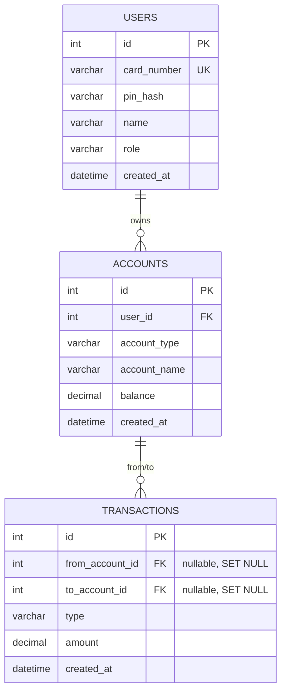

# ATM
PHP "ATM" project

## Installation
1. Clone or copy the project into your web server folder (e.g. `C:\laragon\www`)
2. Start MySQL via Laragon
3. Configure DB credentials in `src/db.php` if they differ from the default
4. Open a terminal, navigate to the project folder, and run the seed script:
    `cd C:\laragon\www\atm_php`
    `php seed.php`
    This creates the database, tables, and test data automatically.

## Running the application

1. Start the web server from the terminal:
    `php -S localhost:8000 -t public`
2. Open `http://localhost:8000` in your browser.

### Test logins
| Role  | Card number  | PIN  | Name              |
|-------|--------------|------|-------------------|
| Admin | 657534096562 | 0000 | Admin Adminsson   |
| Admin | 891823024734 | 9999 | Admina Adminsson  |
| User  | 888519486094 | 1234 | Anna Andersson    |
| User  | 404296523412 | 4321 | Björn Berg        |
| User  | 812889656060 | 1111 | Cecilia Carlsson  |
| User  | 575499033323 | 2222 | David Dahl        |
| User  | 883287214091 | 3333 | Eva Eriksson      |

**The application is now ready to use. Try logging in with one of the accounts above.**

## Database schema

### Tables
- **users**
- **accounts**
- **transactions**

### Relationships
- A user can have many accounts (if a user is deleted, their accounts are deleted too)
- An account can have many transactions (if an account is deleted, the transactions stay but their account references become null)

*A user cannot be deleted if any of their accounts have a non-zero balance. An account cannot be deleted if it has money on it.*

## Features

### Användarfunktioner
- Log in with card number + PIN
- View all own accounts and balances
- Create a new account (max 5 for regular users)
- Deposit and withdraw money
- Transfer between own accounts or to other users
- View own transactions
- Change PIN and request a new card number
- Click on an account ID to see transactions for that account

## Admin features
- Statistics overview: total users, accounts, balances, transactions, and recent activity
- See all users (own row is highlighted)
- Edit a user's name, role, and PIN
- Generate a new card number for a user
- Delete a user (cannot delete yourself or the last admin)
- Click a user's name to see their accounts and transaction history
- Create new users
- See all accounts (own accounts are highlighted)
- Click an account ID to see its transaction history
- Edit account name
- Delete account (only if balance is zero)
- Create new accounts for users
- See all transactions

### Transactions and history
- Click any account ID to view its transactions
- Admins can see all transactions across all users and accounts
- Filter by transaction type:
    - Deposit
    - Withdrawal
    - All transfers
    - Internal transfers (between own accounts)
    - External transfers (between different users)
- Filter by date range
- Pagination on transactions lists (20 per page)

### Other features
- Card numbers are generated with the Luhn algorithm

## Security

### Authentication and roles
- **Session**
    On login, `user_id`, `user_role`, and `user_name` are stored in the session after `session_regenerate_id(true)`. The session is secured with:
    - `cookie_httponly` — cookies cannot be read by JavaScript
    - `cookie_samesite=Strict` — cookies are not sent on cross-site requests
    - `use_strict_mode` — rejects manipulated session IDs
- **Routing**
    In `public/index.php`, every route is filtered through helper functions:
    - `require_auth()` — requires a logged-in user
    - `require_role('admin')` — requires admin role
- **Additional layer**
    Actions and templates check roles and ownership before allowing access.

### Other security measures
- PINs are hashed and salted with bcrypt
- CSRF protection via tokens in all forms
- XSS protection via `htmlspecialchars`
- SQL injection protection via PDO prepared statements
- Sessions expire after 30 minutes of inactivity
- All checks are performed server-side